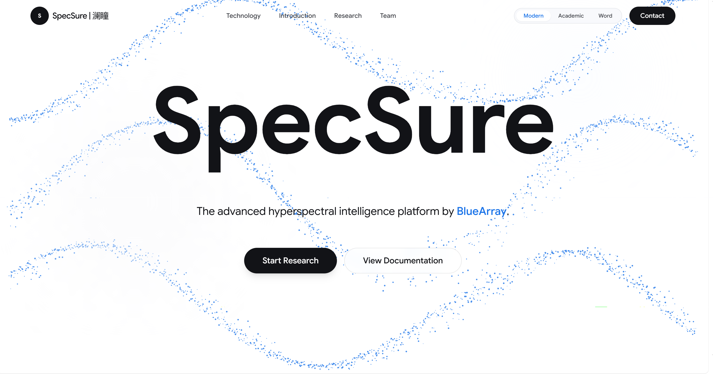
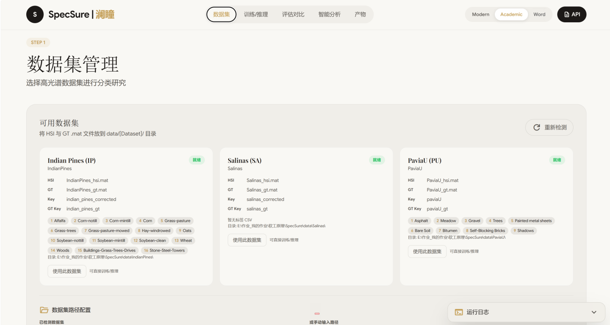
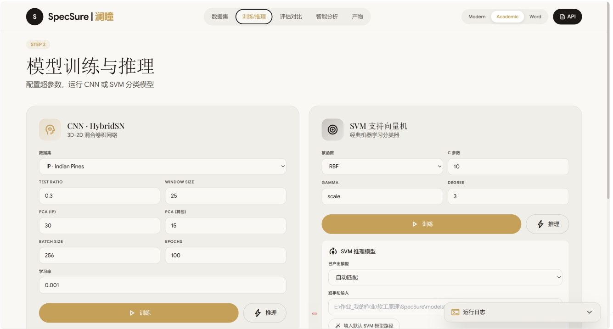
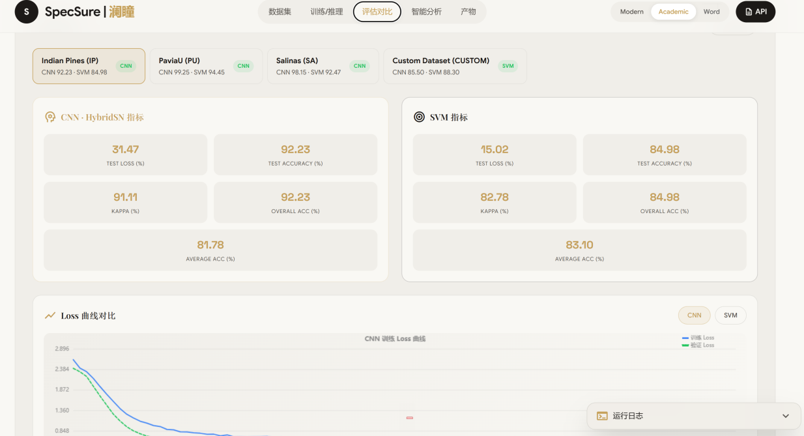
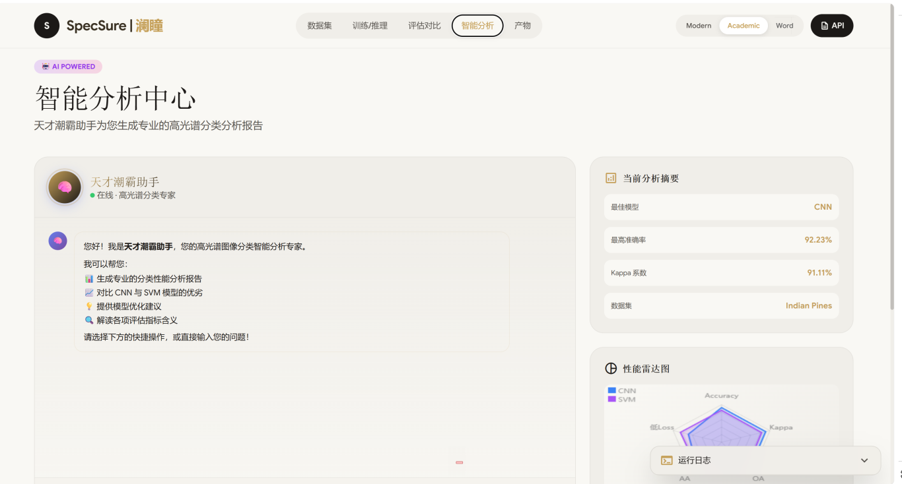
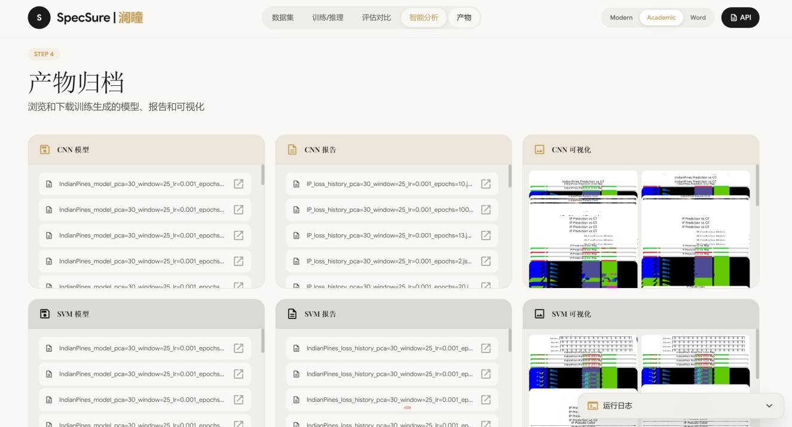

# 🌊 SpecSure（澜瞳）
> 海岸带高光谱数据分类系统。**SpecSure = Spectrum + Sure**

SpecSure 是一个支持 **高光谱数据预处理 → 分类 → 可视化 → 指标评估** 的小型遥感分析系统。你可以把它理解为一个“轻量版 ENVI + AI”，支持用 **SVM（传统 ML）** 或 **CNN（HybridSN 等深度模型）** 跑出分类结果，并生成分类图与评估指标。




---

## 🎯 1. 项目能力概览
- ✅ 支持高光谱立方体（HSI）数据加载与管理
- ✅ 光谱曲线查看（点选像元/区域 → 绘制谱曲线）
- ✅ 两套模型对比：**传统 ML（SVM/RF） vs 深度学习（HybridSN/3D-CNN）**
- ✅ 输出：分类伪彩色图、混淆矩阵、OA / AA / Kappa、每类 PA / UA 等
- 下附视频为系统进行进一步讲解：

<video src="./readme_images/视频.mp4"></video>

---

## 🤝 2. 团队介绍：BlueArray（潮霸）
> 看见光谱之外，分类海岸未来

| 成员 | 标签 |
| --- | --- |
| 👩‍💻 linda1729 | 你永远不知道她做了多少接口 |
| 🧑‍💻 Chenmomo | 会 CNN 魔法的首席大法师（自称） |
| 👨‍🔧 xixiyhaha | 每天都在嘻嘻哈哈做 SVM 的木木大帅哥 |
| 🎨 KeepingMoving | 前端审美的守门人 |
| 🧙‍♂️ Gong | 负责人（真·首席大法师） |

---

## 🌈 3. 功能模块

### 🌐 3.1 数据管理
- 支持 `.hdr + .dat`、`.tif`、`.mat` 等常见高光谱格式（以仓库实现为准）
- 自动展示：行 × 列 × 波段数、波长范围（如 0.4–2.5 μm）
- 假彩色组合（RGB 波段可选）
- 光谱曲线可视化：鼠标点哪里，就画哪里的光谱

### 🧪 3.2 预处理（流水线）
- 噪声波段剔除
- 光谱平滑（SG / 均值滤波）
- 波段选择（手动 / PCA / 自动指标）
- 标准化（z-score / min-max）
- 右侧同步显示光谱变化

### 🤖 3.3 分类
- 模型 A：传统 ML（SVM / Random Forest）
- 模型 B：深度学习（3D CNN / HybridSN）
- 支持 A/B 并行对比

### 🎨 3.4 可视化
- 三联图：原始假彩色 / 模型 A 分类图 / 模型 B 分类图
- 类别伪彩色、真实标注轮廓叠加（若提供）
- 像元信息查询：坐标 / 光谱 / 分类结果

### 📊 3.5 性能评估
- Overall Accuracy（OA）
- Average Accuracy（AA）
- Kappa
- 混淆矩阵热力图（A/B 对比）
- 每类 PA / UA 表格

---

## 🏗️ 4. 仓库结构

```text
SpecSure-main/
├─ backend/                         # Python 后端（FastAPI）
│  ├─ app/                          # 后端核心代码（core / models / services）
│  └─ data/                         # 后端运行数据（models、tmp 等）
├─ frontend/                        # 真实前端（Vite 项目：src/components/public）
├─ mockfrontend/                    # 简易调试前端（静态页）
├─ models/                          # 算法模型
│  ├─ svm/
│  │  ├─ code/SVM/api/              # SVM 代码 & 接口（以实际文件为准）
│  │  ├─ trained_models/SVM/        # 训练好的 SVM 模型
│  │  ├─ reports/SVM/               # 指标报告
│  │  └─ visualizations/            # 可视化输出
│  └─ cnn/
│     ├─ code/HybridSN/api/         # HybridSN 代码 & 接口（以实际文件为准）
│     ├─ trained_models/HybridSN/   # CNN 权重
│     ├─ reports/HybridSN/          # 指标报告
│     └─ visualizations/HybridSN/   # 可视化输出
├─ data/                            # 数据集（IndianPines / PaviaU / Salinas）
├─ requirements.txt                 # Python 依赖（Windows/通用）
├─ Linuxrequirements.txt            # Python 依赖（Linux）
└─ LICENSE
```

---

## 🚀 5. 快速开始（推荐：后端 + mockfrontend 跑通全流程）

### 5.1 安装后端依赖
```bash
pip install -r requirements.txt
# Linux:
# pip install -r Linuxrequirements.txt
```

### 5.2 启动后端（FastAPI）
```bash
uvicorn backend.app.main:app --reload --port 8000
```

打开接口文档：
- http://localhost:8000/docs

### 5.3 启动 mockfrontend（调试用静态界面）
```bash
cd mockfrontend
python -m http.server 5500
```

浏览器访问：
- http://localhost:5500/index.html

使用说明：
- 点击“加载 Demo 数据”后即可跑通：预览 → 预处理 → 训练/预测 → 可视化 → 像元查询/评估
- 默认 API 地址为 `http://localhost:8000`
- 如需自定义后端地址，可在 URL 添加 `?api=http://your-host:port`

---

## 🖥️ 6. 前端（Vite 版，面向真实展示）
> 如果你要使用 `frontend/` 下的真实前端（而不是 mockfrontend），按下面方式启动。

```bash
cd frontend
npm install
npm run dev
```

然后在浏览器中打开终端提示的地址（通常是 http://localhost:5173）。

> 若前端需要配置后端地址（API Base URL），请查看 `frontend/` 中的配置文件或 `.env`（以实际实现为准）。

---

## 🧠 7. 模型训练 / 推理（SVM & CNN）

### 7.1 推荐方式：通过 FastAPI（最省心）
- 打开 http://localhost:8000/docs
- 查找与 `svm` / `cnn` / `train` / `predict` 相关的接口
- 直接在 Swagger UI 中传参调用，可快速复现一套结果

### 7.2 命令行方式：直接运行模型脚本（进阶）
模型代码位于：
- `models/svm/code/SVM/api/`
- `models/cnn/code/HybridSN/api/`

一般包含训练/预测脚本（文件名以目录内实际文件为准）。示例（仅示意）：
```bash
# SVM（示例）
python models/svm/code/SVM/api/train.py --dataset IndianPines
python models/svm/code/SVM/api/predict.py --dataset IndianPines

# HybridSN（示例）
python models/cnn/code/HybridSN/api/train.py --dataset IndianPines
python models/cnn/code/HybridSN/api/predict.py --dataset IndianPines
```

输出位置（通常）：
- 指标：`models/**/reports/**/`
- 权重/模型：`models/**/trained_models/**/`
- 可视化：`models/**/visualizations/**/`

---

## 🗂️ 8. 数据说明
仓库内提供示例数据集目录：
- `data/IndianPines/`
- `data/PaviaU/`
- `data/Salinas/`

> 具体数据文件格式与命名（例如 `.mat/.npy/.hdr+.raw`、标签文件等）请以 `data/` 内实际文件为准；如接入自定义数据，建议保持相同目录结构，避免前后端路径解析出错。

---

## 👀 9. 系统演示页
- 数据集页面



- 训练/推理界面



- 评估对比页面



- 智能分析页面



- 产物归档页面



---

## 🎁 10. License
MIT（详见 `LICENSE`）

---

## 🐳 11. 结语
> 如果你也相信光谱能讲述海岸的故事，  
> 那么 SpecSure 就是你最好的解码器。
