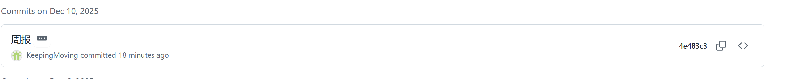

# **实验 6：【Alpha】项目 Alpha 冲刺报告**

项目名：**SpecSure（澜瞳）**

小组名：**BlueArray（潮霸）**

周次：**第12周**

------

# **一、基本情况**

- **团队 ID：** 01
- **组长博客地址：** https://blog.linda1729.com/columns/specsure/
- **小组 Github 仓库地址：** https://github.com/linda1729/SpecSure
- **小组成员：**
  - 前端负责：於佳杰
  - 后端负责：刘芳宇（组长）
  - 模型训练（CNN）：陈怡冰
  - 模型训练（SVM）：邓林
- **本次冲刺范围**：根据附件的项目选题要求和功能结构，完成 CNN 与 SVM 模型结构最终统一，明确模型输入输出参数规范、落实全部可视化结果形式（7 张图）、确认前端商务展示页与功能页整体风格方案、解决代码分支不同步问题并准备最终合并。
  - 选题参考：海岸带高光谱数据分类系统 ([Github链接](https://github.com/linda1729/SpecSure))
  - 分工参考：四模块（前端 / 后端 / SVM / CNN）并行推进 ([Github链接](https://github.com/linda1729/SpecSure))
  - 项目准备内容（数据、技术栈、工具）([Github链接](https://github.com/linda1729/SpecSure))
  - 系统预期功能及结构（最终目标）([Github链接](https://github.com/linda1729/SpecSure))

------

# **二、冲刺概况汇报**

------

## 前端：於佳杰

### ✅ **过去完成了哪些任务**

1. **前端整体商务展示方案确认**
   - 与模型、后端负责人确认首页作为**商务展示型入口**，用于：
     - 团队介绍
     - 项目背景
     - 功能入口跳转
   - 确认首页支持：
     - 人员卡片点击进入博客
     - 图标悬浮玻璃拟态效果
     - 打字机文字动画
     - 模块滑动切换效果
   
2. **配合模型端可视化展示需求**
   - 根据算法侧反馈，确认最终展示：
     - Ground Truth
     - RGB 合成图
     - Predict 分类图
     - Error 对比图
     - 混淆矩阵
     - 推理混淆矩阵
     - 双图对比大图（包含两张）
   - ✅ 共计 **7 张图像展示规范** 最终敲定

3. **准备前端接口对接方案**
   - 明确由前端根据：
     - `PC维度`
     - `窗口大小`
     - `学习率`
     - `训练集名称`
   - 自动拼接并加载对应结果图片路径

### 📁 **Github 提交记录截图**

### 🔮 接下来的计划

- 完成商务首页最终版定稿
- 接入训练结果可视化接口
- 联调 CNN + SVM 双模型展示页面
- 增加默认数据集可选列表（读取 CSV 标签）

### ⚠ 遇到的问题

- 当前算法分支与主分支存在依赖不一致问题，需要在后端合并时统一依赖环境。
- 7 张图片在页面排版上对齐方案需要进一步设计。

## 后端&组长工作：刘芳宇

### ✅ **过去完成了哪些任务**

> 看详细的工作修改与进度可以直接去https://github.com/linda1729/SpecSure/tree/main/dos/w11/backend

1. - - **整体系统架构复核**
       - 确认当前后端架构以：
         - FastAPI
         - Mock 前端测试
         - 云端 GPU 分离式部署为核心
     - **模型接口对齐与分支合并规划**
       - 明确 CNN 与 SVM 两套模型：
         - 训练接口完全统一
         - 推理接口完全统一
       - 确认分支问题：
         - 当前个别成员仍基于旧分支开发
         - 本周内完成二次强制同步与合并
     
     - **内置数据集与 CSV 标签机制确认**
       - 后端已内置三套默认数据集
       - 每个数据集配套：
         - 标签 CSV 文件
         - 前端可直接读取显示类别信息
     
     - **公网服务器与本地展示方案确定**
       - 公网 GPU 服务器仅用于训练
       - 最终展示统一采用：
         - 本地部署
         - 本地联调
         - 避免公网服务器额外成本消耗

### 📁 **Github 提交记录截图**

> 图片占位符

- ### 🔮 接下来的计划

  - 今日内完成模型接口最终合并
  - 统一依赖包与 requirements
  - 协助前端完成最终可视化对接
  - 准备结项展示环境

  ### ⚠ 遇到的困难

  - 个别成员分支版本滞后，存在文件冲突风险
  - 公网推理服务器成本较高，不适合作为长期展示平台

------

## **CNN 模型：陈怡冰**

### ✅ 过去完成的任务

1. **CNN 结构最终工程化落地**
   - 完整拆分为：
     - Model
     - Train
     - Infer
     - Visualization
     - Reports
   - 所有训练、验证、推理统一入口函数
2. **完整结果产物输出**
   - 每次训练自动生成：
     - 分类预测图
     - 混淆矩阵（训练）
     - 混淆矩阵（推理）
     - RGB 伪彩图
     - Correct / Error 对比图
     - 双图对比融合图
     - 指标报告 txt

3. **参数命名规范统一**
   - 所有输出文件统一包含：
     - 数据集名
     - PCA 维度
     - 窗口大小
     - 学习率

### 📁 Github 提交记录截图

### 🔮 接下来的计划

- [x] **撰写对接文档**：编写详细的 API 调用文档，明确 Input（前端传入参数）和 Output（返回 JSON 格式及图片路径），发给队长。

- [ ] **可视化：**提供训练loss曲线图

- [ ] **接口标准化**：根据后端反馈，调整接口的输入输出格式，确保能顺利接入 Web 系统。

- [x] **小规模测试**：准备一份小规模数据集，方便团队成员在非 GPU 环境下进行联调。

- [ ] **调研多模态方案**：探索是否可将光谱特征 + 空间纹理联合建模

### ⚠ 困难

- **计算资源**：本地训练速度较慢，需要优化数据加载策略。
- **接口对齐**：需要确保模型输出的 numpy 格式能被后端正确序列化为 JSON 发送给前端。

------

## **SVM 模型：邓林**

### ✅ 过去完成的任务

1. **SVM 模型完全对齐 CNN 输出规范**
   - 图像数量由原本 4 张 → 统一为 **7 张**
   - 报告格式与 CNN 完全一致
   
2. **与 CNN 模型输出逻辑完全统一**
   - 指标项一致
   - 可视化类型一致
   - 文件命名规则一致

3. **模型接口已完成最终对齐**
   - 训练接口
   - 推理接口
   - 日志输出接口全部与后端接口规范一致

### 📁 Github 提交记录截图

* ### 🔮 接下来的计划

  - 今日内完成最终代码同步合并
  - 协助前端调试 SVM 可视化加载
  - 输出最终性能对比实验结果

  ### ⚠ 遇到的困难

  - 旧版本分支与主分支存在历史文件差异
  - 早期生成图片格式与当前版本存在不兼容问题，已逐步修复

------

# **三、冲刺成果展示**

## **1. 组内最新成果展示**

以下成果基于目前 Alpha 阶段进展：

### **① 系统整体 UI 原型（前端：於佳杰）**

------

### **② 后端与 Mock 前端（后端：刘芳宇）**

------

### **③ CNN模型重构与可视化（算法：陈怡冰）**

------

### **④ SVM模型重构与可视化（算法：邓林）**

**⑤ 项目管理完成度**

已完成：

- **cnn和后端对接**：cnn和后端已经成功对接
- **前端风格确定**：确定前端风格和多mode模式。

------

## **2. 站立会议合照**

------

## **3. 会议时间、地点、内容记录**

- **时间：** 12 月 10 日

- **地点：** 线下会议室

- **记录内容：**

    1. 各成员分别汇报了本周进度，重点围绕 **CNN、SVM 模型最终对齐情况** 以及 **前端商务展示页面方案** 展开。
    2. 确认当前 CNN 与 SVM 模型在：
       - 训练接口
       - 推理接口
       - 指标输出
       - 可视化结果数量（统一为 7 张）
       上已完成统一规范。
    3. 明确所有模型输出图片的命名规则需统一包含：
       - 数据集名称
       - PCA 维度
       - 滑动窗口大小
       - 学习率等关键参数，便于前端通过参数自动加载结果。
    4. 讨论并最终确定：
       - 模型训练阶段继续使用 **公网 GPU 服务器**
       - 项目最终展示统一改为 **本地部署 + 本地演示**，以降低服务器成本。
    5. 针对当前代码分支不同步问题，会议要求：
       - 所有成员本周内必须完成与主分支的同步合并
       - 避免在旧分支继续开发，防止后期大规模冲突。
    6. 前端展示方面，确认首页采用 **偏商务风格设计**，作为对外展示入口，功能页面作为二级页面保留。
    7. 明确下周工作重点为：
       - 完成最终功能联调
       - 固定展示版本

- **核心结论**：

  1. 所有模型可视化输出 **统一为 7 张图**
  2. 前端首页采用 **偏商务展示风格**
  3. 模型训练使用公网 GPU，展示统一改回本地
  4. 所有成员本周内必须完成最终分支合并
  5. 下周进入 **最终展示准备阶段**

  

  